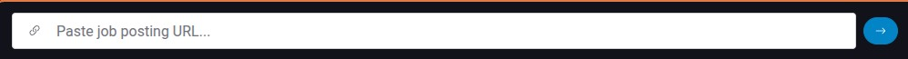
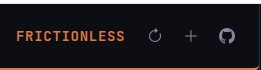

# Job Tracker for Frictionless UI

Track job applications through the hiring pipeline with an AI-powered assistant.

## Features

### Application List
- Sortable columns: Company, Position, Status, Date
- Click headers to sort ascending/descending
- Filter tabs: All, Active, Offers, Archived
- Click any row to view details
- Reload button to refresh from disk

### Application Details
Each application tracks:
- Company name and position title
- Job posting URL (viewable in embedded iframe)
- Date added and date applied
- Current status (quick-change dropdown)
- Salary range (min/max)
- Location / Remote status
- Company HQ address
- Notes (collapsible section)

### Status Pipeline
- **Bookmarked** - Interested, haven't applied yet
- **Applied** - Application submitted
- **Phone Screen** - Initial recruiter/HR call
- **Technical** - Technical interview stage
- **Onsite** - Onsite/final round interviews
- **Offer** - Received offer
- **Rejected** / **Withdrawn** / **Archived**

### File Attachments
- Drag-and-drop files onto any application
- File picker button for selecting files
- Attach resumes, cover letters, offer documents
- Save/Revert buttons appear when files are modified
- Warning dialog prevents losing unsaved changes
- Files stored locally with fossil version control

### Activity Timeline
- Automatic status change logging
- Add custom notes to any application
- Full history of each application's journey

### Claude Integration
- **Paste a job URL** into the URL field - Claude scrapes company, position, location, salary

- Claude searches for salary data if not listed in posting
- Claude finds company HQ address

## Data Storage

All data stored locally in `.ui/storage/job-tracker/`:
```
data/
├── data.json           # Application data
└── jobs/
    ├── 0001/           # Attachments for app ID 1
    │   ├── resume.pdf
    │   └── cover.docx
    └── 0002/           # Attachments for app ID 2
```

Version controlled with fossil for history and rollback.

## UI Layout

### List View
```
+------------------------------------------+
|  Job Tracker              [Reload][+ Add]|
+------------------------------------------+
| [All] [Active] [Offers] [Archived]       |
+------------------------------------------+
| COMPANY▼       POSITION      STATUS  DATE|
| ---------------------------------------- |
| > SoFi         Staff Eng     Applied 2/1 |
|   Deel         Sr Full Stack Applied 1/28|
|   Stripe       Backend Eng   Phone   1/25|
+------------------------------------------+
| [Paste job URL...]                    [>]|
+------------------------------------------+
```

### Detail View
```
+------------------------------------------+
| <- Back           [✓][↺][Edit][Delete]   |
+------------------------------------------+
| Acme Corp                                |
| Senior Software Engineer                 |
| Status: [Phone Screen v]                 |
+------------------------------------------+
| Applied: Jan 15 | Remote | $180-220k     |
| HQ: San Francisco, CA                    |
+------------------------------------------+
| [Notes]  <- collapsible                  |
+------------------------------------------+
| ATTACHMENTS                    [+ File]  |
| resume.pdf                          [x]  |
| cover-letter.docx                   [x]  |
| Drop files here to attach                |
+------------------------------------------+
| [View job posting ↗]                     |
+------------------------------------------+
| TIMELINE                         [+ Note]|
| Jan 20 - Status: Phone Screen            |
| Jan 15 - Added application               |
+------------------------------------------+
```

## Getting Started

1. Install [Frictionless](https://github.com/zot/frictionless)
2. Use `/ui show` to view the app console.  
   - click the tools button if app console is not visible  
   
3. In the app console, click the github button to add job tracker  
   
4. Paste in the URL: `https://github.com/zot/frictionless/tree/main/apps/job-tracker`
5. Select Job Tracker from the app menu  
   

## License

Part of [Frictionless UI](https://github.com/zot/frictionless) - MIT License
