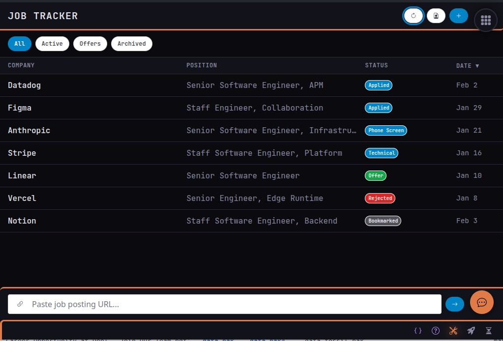
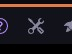
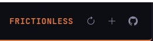
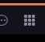

# Job Tracker for Frictionless

Track job applications through the hiring pipeline with an AI-powered assistant. See [ABOUT.md](ABOUT.md) for full feature details.

## Prerequisites

- [Claude Code](https://docs.anthropic.com/en/docs/claude-code/overview) (CLI)

## Install Frictionless

Start Claude Code in whichever project directory you want to use for the job tracker. Your application data will be stored there, in `.ui/storage/job-tracker/`.

Tell Claude:

> Install using github zot/frictionless readme

Claude will fetch Frictionless and install it. Because Frictionless runs as an MCP server, you'll need to restart Claude Code after installation (just this once).

## Install Job Tracker

After restarting Claude Code, tell Claude:

> /ui

This opens the Frictionless dashboard in your browser, with a short tutorial on first run.

To add the job tracker app:

1. Click the tools button in the bottom bar to open the app console
   

2. Click the GitHub button at the top of the app console
   

3. Paste this URL: `https://github.com/zot/frictionless/tree/main/apps/job-tracker`

4. Click **Investigate**, review the files, then click **Approve**

## Run It

Click the menu button at the bottom of the page and select **Job Tracker**.

## License

Part of [Frictionless](https://github.com/zot/frictionless) - MIT License
